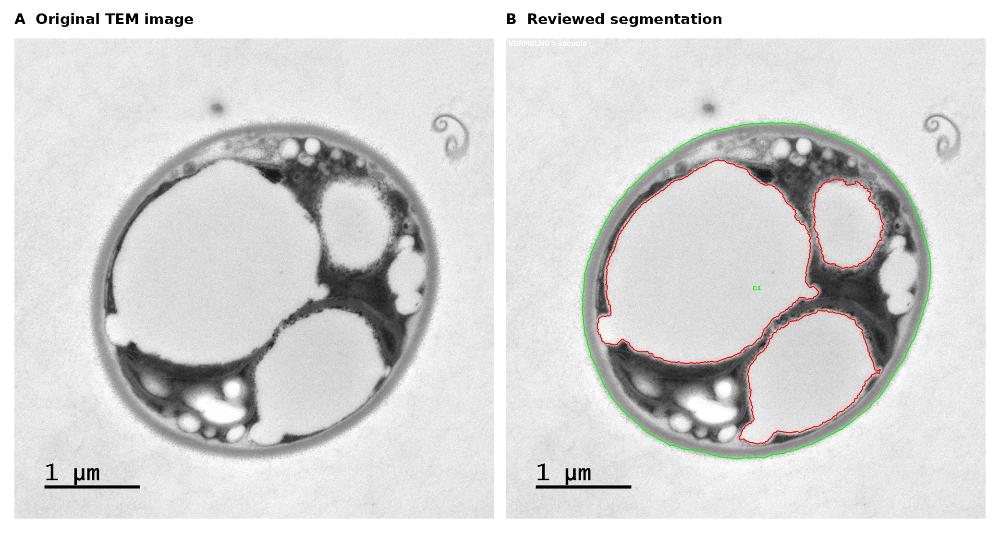

# TEM Vacuole Area Analyzer

A semi-automatic Python workflow for **cell segmentation, vacuole review, and vacuole-area quantification in transmission electron microscopy (TEM) images of *Chlorella vulgaris*.**

**Author:** Adriana Pereira C. Sánchez  
**Repository:** `Chlorella-TEM-Vacuole-Analyzer`  
**License:** MIT  
**Associated manuscript:** *Microfluidic separation for microalgae: what matters is the inside of the cell*  
**Manuscript status:** Unpublished

## Purpose

TEM Vacuole Area Analyzer was developed to quantify the intracellular vacuolar area of *Chlorella vulgaris* cells from TEM images. The workflow combines automatic image preprocessing and segmentation with an interactive review step so that automatically proposed contours can be checked and corrected before quantitative data are exported.

For each reviewed cell, the software reports:

- cell area;
- number of vacuoles;
- summed vacuole area;
- vacuole-to-cell area ratio (%);
- cell and vacuole areas in µm² when spatial calibration is available.

The software also creates annotated images and a PowerPoint report for visual quality control.

## Example of the analysis

The example below shows a representative *Chlorella vulgaris* TEM image before and after analysis with the TEM Vacuole Area Analyzer.



**Representative analysis example.** (A) Original TEM image of a *Chlorella vulgaris* cell. (B) Reviewed segmentation generated using TEM Vacuole Area Analyzer. The **green contour** represents the detected cell boundary, while **red contours** represent the reviewed vacuole boundaries. Scale bar: 0.5 µm.

## Analysis workflow

```text
TEM images
    ↓
brightness / contrast normalization
    ↓
scale-bar detection and OCR
    ├── automatic calibration when successful
    └── manual calibration or pixel-only processing when needed
    ↓
automatic cell segmentation
    ↓
automatic vacuole pre-detection
    ↓
interactive review of every image
    ├── A: add a missing vacuole from a seed click
    ├── B: manually draw a vacuole
    └── C: erase an unwanted contour
    ↓
quantification
    ↓
Excel + annotated images + PowerPoint + processing log
```

In the annotated images, **green contours represent cell boundaries** and **red contours represent reviewed vacuoles**.

## Requirements

Python 3.10 or newer is recommended.

Install the Python dependencies with:

```bash
pip install -r requirements.txt
```

The current workflow uses NumPy, OpenCV, tifffile, imagecodecs, pytesseract, pandas, openpyxl, python-pptx, Pillow, and Matplotlib.

### Tesseract OCR

Automatic reading of the scale label requires the **Tesseract OCR application**, in addition to the Python package `pytesseract`.

On Windows, install Tesseract and make sure `tesseract.exe` is either available in the system PATH or in a location searched by the script. The program also supports a manually specified Tesseract path through `CONFIG.TESSERACT_CMD`.

If Tesseract is unavailable, or if OCR fails for a particular image, the workflow can continue using manual calibration. Calibration failures can also be processed in pixel units when that option is selected.

## Input images

Supported formats are `.tif`, `.tiff`, `.png`, `.jpg`, and `.jpeg`.

The program is designed for grayscale TEM images. TIFF files containing microscopy metadata can also be loaded. Place the images to be analyzed in a single folder. The results folder created by the program is ignored during subsequent input-file discovery.

## How to run

From a terminal opened in the repository folder:

```bash
python src/tem_vacuole_area_analyzer.py
```

The program opens a folder-selection window. Select the folder containing the TEM images. A parameter window is then displayed. The default values correspond to the dataset for which the workflow was developed, and parameters can be adjusted without editing the source code.

The program processes the images sequentially and opens each analyzed image for interactive review before export.

## Interactive review

Every processed image is reviewed before it is accepted.

### A — Add a missing vacuole from a seed click

Press `A`, then click inside a missing vacuole. The program samples the local grayscale intensity around the click and grows a connected region inside the corresponding cell. Candidate regions are constrained by geometric criteria such as relative area, circularity, solidity, and aspect ratio.

### B — Draw a vacuole manually

Press `B`, then hold the left mouse button and draw the desired vacuole boundary. The drawn region is restricted to the corresponding cell mask before it is accepted.

### C — Erase an unwanted vacuole

Press `C`, then click inside a red vacuole contour to remove it.

### Additional controls

| Control | Action |
|---|---|
| `A` | Seed-guided vacuole addition |
| `B` | Manual vacuole drawing |
| `C` | Erase a selected vacuole |
| `Enter` | Approve the current image |
| `Delete` or right click | Undo the last selection |
| `S` | Clear all vacuole selections from the current image |

## Cell segmentation

Cells are initially detected as regions that are darker than the surrounding TEM background. Morphological filtering is used to remove noise, close interrupted cell regions, fill internal holes, and refine the external cell silhouette.

The external cell contour is further refined to reduce inward indentations that can occur when a bright vacuole lies close to the cell membrane. Cell candidates are filtered using area, solidity, and aspect-ratio criteria.

A particularly important parameter when two nearby cells are incorrectly merged is:

```python
CLOSE_KERNEL_CELL
```

Reducing this value makes the algorithm less likely to connect two neighboring cells. Increasing it helps reconnect separated parts of the same cell.

## Vacuole detection

The automatic stage proposes intracellular vacuole candidates using a combination of shape, local grayscale information, texture, and morphological criteria. Candidate contours must remain within the detected cell.

The workflow was developed for vacuoles that may be round or elongated and may occupy a large fraction of the cell. The current configuration allows up to five reviewed vacuoles per cell.

Automatic vacuole detection is treated as a **pre-selection step**. The final accepted segmentation is established during interactive review.

## Brightness normalization

TEM images from different acquisitions may have different overall brightness levels. When `NORMALIZE_BRIGHTNESS = True`, each image is normalized using configurable lower and upper intensity percentiles before segmentation.

If an image remains dark after normalization, optional automatic gamma correction can increase its brightness for analysis. The original image file is not overwritten.

## Scale calibration

The program searches for the scale information in the lower-left region of the image. When automatic calibration succeeds, it detects the horizontal scale bar when possible, reads the printed scale value using OCR, recognizes µm or nm units, converts the value to micrometers, and calculates the spatial calibration in µm/pixel.

If the scale bar length cannot be measured automatically, `SCALEBAR_LENGTH_PX` is available as a fallback. When OCR fails, the user can perform manual calibration by entering the printed scale value and marking the scale-bar endpoints. The workflow can alternatively process calibration failures in pixel units.

## Main adjustable parameters

### Cell parameters

| Parameter | Default | Function |
|---|---:|---|
| `CELL_REENTRANCE_CLOSE_PX` | 51 | Closes inward indentations in the external cell boundary. |
| `CELL_OUTER_MAX_EXPANSION` | 0.18 | Limits expansion caused by external-boundary refinement. |
| `CLOSE_KERNEL_CELL` | 91 | Reconnects separated regions of the same cell; reduce it if nearby cells merge. |
| `OPEN_KERNEL_CELL` | 9 | Removes thin bridges and small artifacts. |
| `MIN_CELL_AREA_FRAC` | 0.01 | Minimum accepted cell area relative to the image. |
| `MAX_CELL_AREA_FRAC` | 0.85 | Maximum accepted cell area relative to the image. |
| `MIN_CELL_SOLIDITY` | 0.75 | Minimum contour compactness. |
| `MAX_CELL_ASPECT_RATIO` | 2.5 | Maximum accepted cell elongation. |
| `MAX_CELLS_PER_IMAGE` | 4 | Maximum number of accepted cells per image. |

### Interactive vacuole parameters

| Parameter | Default | Function |
|---|---:|---|
| `MANUAL_SEED_PATCH_RADIUS` | 5 px | Neighborhood used to estimate local vacuole intensity after a click. |
| `MANUAL_SEED_MIN_AREA_FRAC` | 0.004 | Minimum accepted seed-guided vacuole area relative to the cell. |
| `MANUAL_SEED_MAX_AREA_FRAC` | 0.90 | Maximum accepted vacuole area relative to the cell. |
| `MANUAL_SEED_MIN_CIRCULARITY` | 0.18 | Minimum circularity for seed-guided candidates. |
| `MANUAL_SEED_MIN_SOLIDITY` | 0.68 | Rejects strongly indented or fragmented candidates. |
| `MANUAL_SEED_MAX_ASPECT_RATIO` | 3.5 | Maximum accepted elongation. |
| `MANUAL_SEED_SMOOTH_FRAC` | 0.018 | Boundary smoothing relative to cell diameter. |
| `MAX_VACUOLES_PER_CELL` | 5 | Maximum number of reviewed vacuoles per cell. |

### Scale and brightness parameters

| Parameter | Default | Function |
|---|---:|---|
| `SCALEBAR_LENGTH_PX` | 500 px | Fallback scale-bar length when automatic measurement fails. |
| `SCALEBAR_SEARCH_WIDTH_FRAC` | 0.50 | Width of the lower-left scale search region. |
| `SCALEBAR_SEARCH_HEIGHT_FRAC` | 0.30 | Height of the lower-left scale search region. |
| `NORMALIZE_BRIGHTNESS` | `True` | Enables percentile-based brightness normalization. |
| `BRIGHTNESS_LOW_PERCENTILE` | 1 | Lower normalization percentile. |
| `BRIGHTNESS_HIGH_PERCENTILE` | 99 | Upper normalization percentile. |
| `AUTO_GAMMA` | `True` | Enables adaptive brightening of images that remain dark. |

## Recommended parameter-adjustment order

For a new TEM dataset, avoid changing many parameters simultaneously. First verify the green cell boundary, then adjust cell-boundary parameters if necessary, inspect automatic vacuole proposals, use the A/B/C review tools for individual corrections, and change vacuole or brightness parameters only when a systematic problem is present across multiple images.

## Output

The program creates a `vacuole_results` folder inside the selected input directory:

```text
vacuole_results/
├── annotated_images/
│   └── <image_name>_annotated.jpg
├── vacuole_results.xlsx
├── vacuole_report.pptx
└── processing_log.txt
```

The Excel workbook contains a cell-level table and an image-level summary. Cell-level measurements include source file, cell number, number of vacuoles, cell area in pixels², total vacuole area in pixels², vacuole/cell area ratio (%), calibration in µm/pixel, calibration method and details, and cell/vacuole areas in µm² when calibration is available.

## Quality control

The annotated images and PowerPoint report are intended for visual verification of the segmentation. Automatic TEM segmentation should not be considered ground truth. TEM contrast can change with sample preparation, staining, section thickness, acquisition settings, intracellular composition, and image brightness. For this reason, the workflow requires interactive review before measurements are exported for analysis.

Users applying the software to a different dataset should validate the segmentation parameters for their own images.

## Reproducibility

For analyses reported in a publication, record the software version or Git commit, any parameters changed from the repository defaults, whether scale calibration was automatic or manual, whether any images were analyzed only in pixel units, and the reviewed annotated images used for quality control.

A tagged release should be used for the version associated with the manuscript.

## Citation

If you use this software, please cite the software repository and the associated article when available.

Suggested software citation before a DOI is assigned:

> Pereira C. Sánchez, A. (2026). *TEM Vacuole Area Analyzer: a semi-automatic Python workflow for vacuole quantification in transmission electron microscopy images of Chlorella vulgaris*. GitHub repository.

The repository also includes a `CITATION.cff` file so that GitHub can provide a **Cite this repository** option.

## Associated manuscript

*Microfluidic separation for microalgae: what matters is the inside of the cell*

Status: **unpublished**.

The repository should be updated with the final article citation and DOI after publication.

## License

Copyright (c) 2026 Adriana Pereira C. Sánchez.

This software is distributed under the **MIT License**. See `LICENSE` for the complete license text.

## Disclaimer

This software was developed for research use and for a specific TEM image-analysis workflow. Results should be visually verified before scientific interpretation or publication.
